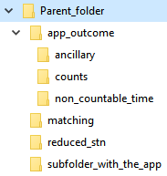
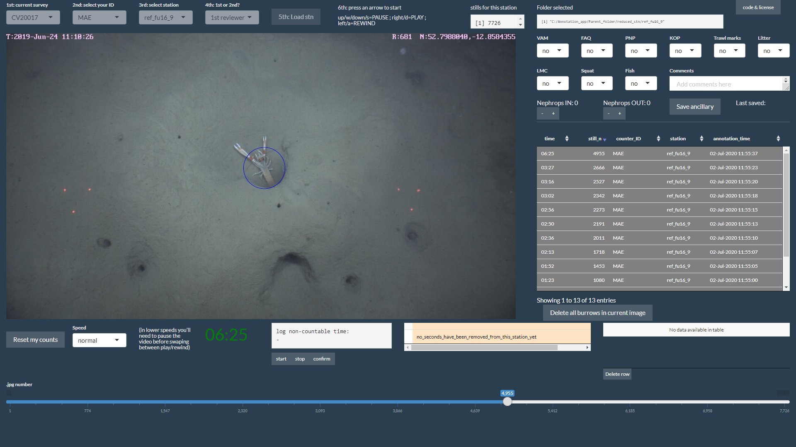

# *Image annotation R Shiny app*

This R Shiny application was built to annotate footage (HD-stills) from _Nephrops norvegicus_ UWTV surveys carried out by the Marine Institute (Ireland).

## Dependencies

The app is stable under R (Version 3.6.3), RStudio (Version 1.1.463) and the following R libraries:  
"colorspace", "DT", "exifr", "gtools", "hms", "jpeg", "magick", "plotrix", "raster", "shiny", "shinyBS", "shinyFiles", "shinyjs", "shinythemes", "shinyWidgets" 

Few extra libraries for Annotations comparison / matching code (new feature 2020): "epiR", "ggplot2", "gridExtra", "reshape2")

Two additional software were used to ensure correct extraction of exif information from the images:

* ActivePerl (Version 5.26). https://www.activestate.com/products/activeperl/
* ExifTool (Version 11.26). https://sno.phy.queensu.ca/~phil/exiftool/index.html

The app has only been tested in Windows 10 and 7. For better performance we suggest to use Google Chrome for the GUI.

## Set up

The app requires an specific folder structure around to read the images (input), and to write .csv and .txt files with the data generated by the app (output):

### Parent folder
Set up in the code by...  
"volumes_parent <- c(Home = "C:/Parent_folder", getVolumes()())""

### Inside the parent folder we need four subfolders:

#### Subfolder for the app
* No need to set up in the code.  
* Example: C:/Parent_folder/subfolder_with_the_app  
* Inside this subfolder we will have the app.R script with all the code.

#### Subfolder for the images:
* Set up in the code by...  
"volumes <- c(Home = "C:/Parent_folder/reduced_stn", getVolumes()())""
* Inside this subfolder we will have one subsubfolder for each station carried out during the survey, for example: C:/Parent_folder/reduced_stn/stn_122
* Inside each station's subsubfolder we will have another folder called "reduced_images", for example: C:/Parent_folder/reduced_stn/stn_122/reduced_images
* Inside this last folder we will have all the .jpg files for the station.

##### Format of the images:
To ensure proper functioning of the app, the images must be:
* .jpg files
* Maximum size of 135 kB
* Dimmensions of 1229 x 691 pixels (for 24-27 inches monitors)

#### Subfolder for the outputs:
* No need to set up in the code.  
* Specific name: C:/Parent_folder/app_outcome  
* Inside this subfolder we will have three subsubfolders for different outputs:  
* C:/Parent_folder/app_outcome/ancillary  
* C:/Parent_folder/app_outcome/non_countable_time  
* C:/Parent_folder/app_outcome/counts  
Inside the subsubfolder for the counts we will have a .csv file called "SURVEYS_and_COUNTERS.csv" with three columns: "survey", "counter" and "VideoOperatorID". This .csv file must be filled out by the SIC.  

#### Subfolder for the Annotations comparison / matching code (new feature 2020):
* Details below

## app GUI

Once the app is running, the user should follow these steps:
* Select a Survey ID
* Select a Counter ID
* Select a Station ID
* Select reviewer number
* Press "load" button
* Check if number of images is correct
* Press an arrow on the keyboard
* Images should start displaying in the GUI
* Footage viewer instructions:
  * Up arrow / w / down arrow / s: Pause
  * Rigth arrow / d: Play
  * Left arrow / a: Rewind
  * Timer under the image shows current time along the station (starts on 00:00, and should finish on 10:00 for 10 minute stations)
  * Speed selector next to the timer to make the 'video' slower
  * Annotation of footage:
    * Pause the footage and click on the burrow you want to annotate. A blue circle will appear where you clicked, and a new row will be added on the table to the right of the image.
    * To delete annotations: select the row you want to delete on the table. Press 'Delete all burrows in current image' button
    * This table will update live a .csv file called surveyID_stationID_counterID_counts.csv inside app_outcome/counts
  * Ancillary data:
    * Record the ancillary information with the dropdown menus, _Nephrops_ counters and comments box on the top-right section
    * The ancillary information will be saved automatically into a .csv file inside app_outcome/ancillary (new feature 2020)
    * As an special request from Ifremer (France), if the Survey ID contains the word "IFREMER", the ancillary data displayed will be different, including for example a counter for squat lobsters (new feature 2020)
    * The 2nd reviewer will only see the comments box (new feature 2020)
  * Non-countable time:
    * use 'start', 'stop', and 'confirm' buttons to log in non-countable time (i.e. sand cloud covering the image) -> app_outcome/non_countable_time.
    * Only the 1st reviewer will be able to log non-countable time (new feature 2020)
    * Both 1st and 2nd reviewers will see a panel with the non-countable amount of seconds for each minute on a right side panel. If there are more than 30 non-countable seconds in a minute, the background of this minute will be red, else green (new feature 2020)
    * Only the 1st reviewer will see all the logs on an extra right side panel. The 1st reviewer can delete logs from this table (new feature 2020)

## Annotations comparison / matching (new feature 2020)

This feature allows to compare the annotations from two surveyID_stationID_counterID_counts.csv files from the same station but different counters.
* If you select "SIC_matching" as your Counter_ID, a window will pop out, showing you pairs of .csv files. These pairs will be all the possible combinations of .csv files that you have in your app_outcome/counts folder (only pairing .csv files of the same station)
* Select the pair you want to compare
* Next pop out window: Select the minutes you want to compare
* The app will run Lin's concordance correlation coefficient test and a recently developed new matching code, which will try to match the annotations from both counters.
* A plot will be generated on the top right showing: station number, Lin's CCC value, minutes included in the analysis and the matching plot:
  * X axis = width of the screen, Y axis = still number
  * Scatterplot of the annotations, labelled with the still number
  * Each of the four colours represents the counter and whether the annotation matches with any other annotation from the other counter
  * A table inside the plot shows the amount of matches and no-matches of each counter, both in number and percentage
* Press "Load" button to load the images
  * In the table with the annotations on the right you will see all the annotations from both counters, with a column specifying the counter and if it matches with any other annotation from the other counter (yes/no)
  * The colour of the circles in the images should match with the colours of the plot

## Patches and pull requests

Your patches are welcome. Here is the suggested workflow:
* Fork the project.
* Make your feature addition or bug fix.
* Send a pull request with a description of your work.

Or as an alternative:
* Report your bugs/feature requests using the github issues tab.

## Author
Mikel Aristegui  
Fisheries Ecosystems Advisory Services,  
Marine Institute / Foras na Mara,  
Ireland

mikel.aristegui@marine.ie

To cite this software, please use the following text:

Aristegui, M. (2020) Image annotation R Shiny app. Marine Institute. http://doi.org/c8jt

## License
Released under the [GNU AGPLv3 license] https://github.com/IrishMarineInstitute/Image-annotation-R-Shiny-app/blob/master/LICENSE.md
